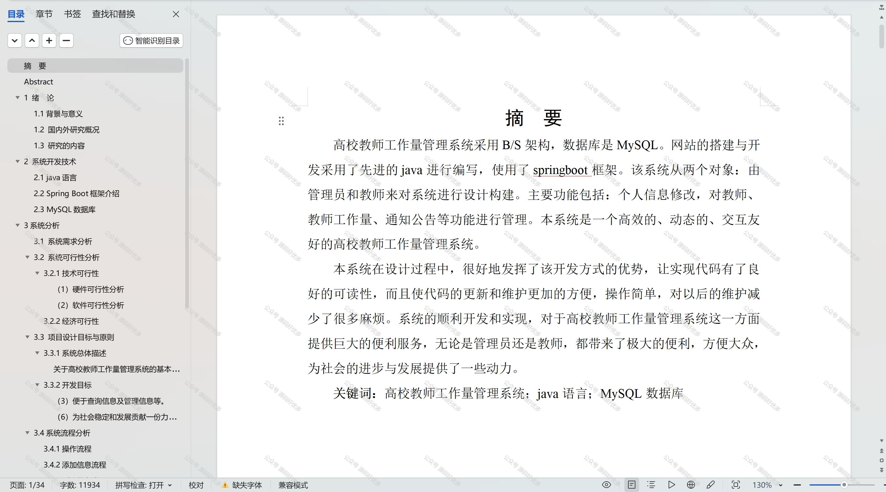

 
## 查看主页获取源码

### 一、作品包含

源码+数据库+设计文档万字+PPT+全套环境和工具资源+部署教程

### 二、项目技术

前端技术：Html、Css、Js、Vue、Element-ui

数据库：MySQL

后端技术：Java、Spring Boot、MyBatis

  

### 三、运行环境

开发工具：IDEA/eclipse

数据库：MySQL5.7

数据库管理工具：Navicat10以上版本

环境配置软件： JDK1.8+Maven3.6.3

前端Nodejs：14

### 四、项目介绍
项目编号：springbootA198

在高等教育规模不断扩大、教育质量要求日益提高的背景下，高校教师工作量管理系统应运而生。该系统旨在通过信息化手段，对教师的教学、科研、社会服务等各项工作量进行科学、规范的管理和统计，以提高工作效率，合理分配资源，促进教师职业发展，同时为高校管理层提供决策支持，确保教学科研活动的有序进行，推动高等教育内涵式发展。

系统分为管理员和教师
管理员的功能：系统首页、个人中心、教师管理、教师工作量管理、通知公告管理。
教师的功能：系统首页、个人中心、教师工作量管理、通知公告管理。

### 五、运行截图

  
